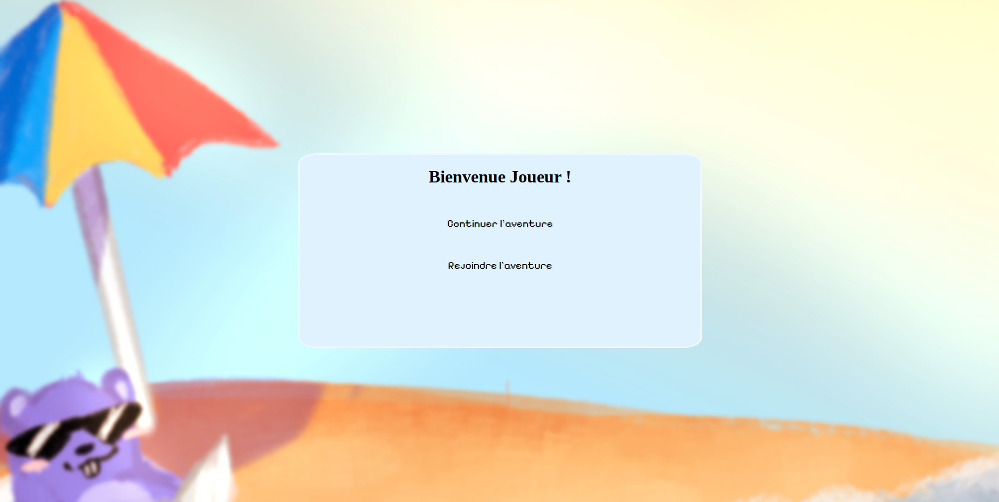
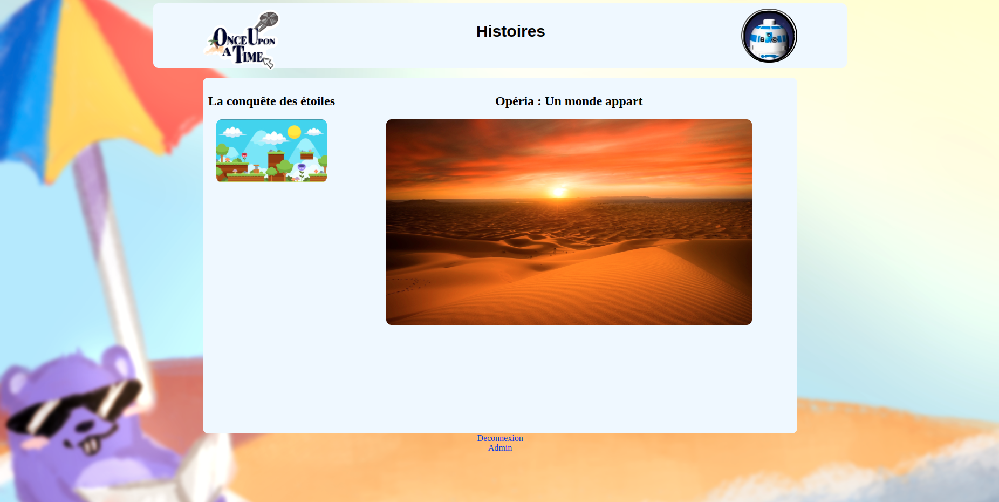
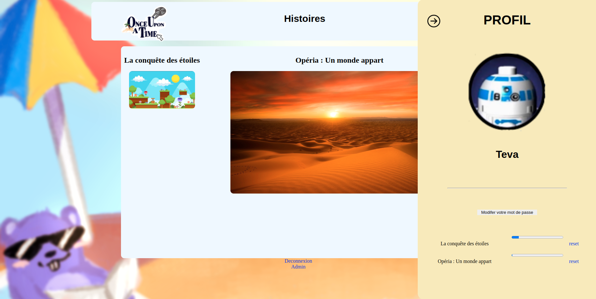
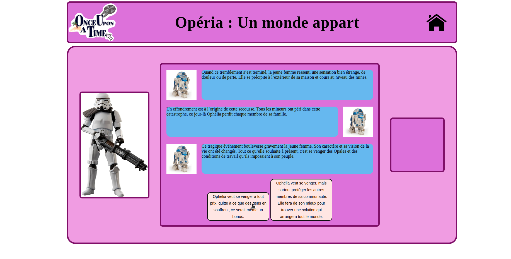
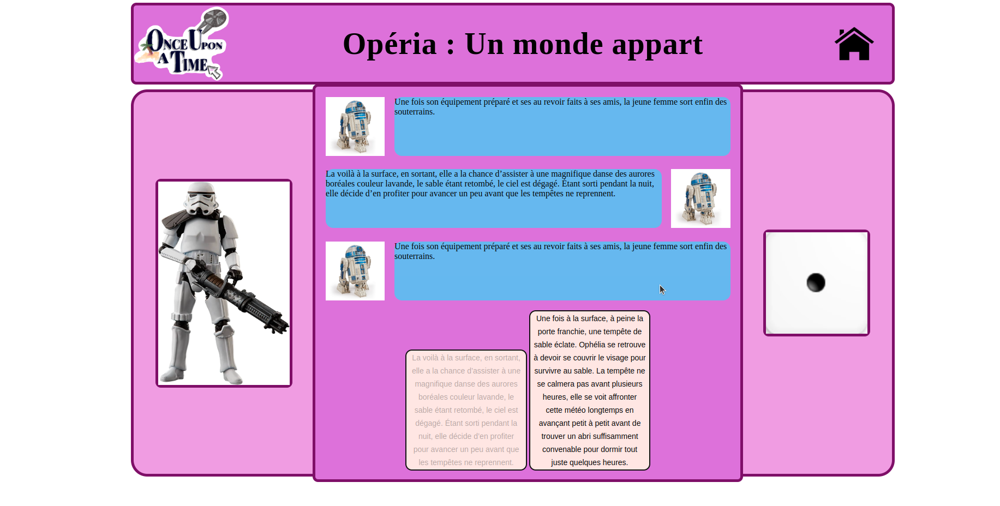

# L1_Projet_Jeux_WEB
## Once upon a time

### Le jeu
Il s'agit d'un projet de création d'un jeu web réalisé par quatre étudiants en L1 Info à L'USMB (2023-2024).

### Pitch :

Plongez dans un monde d’histoires interactives où chaque choix compte. Le joueur est guidé à travers des récits captivants, ponctués par des décisions stratégiques et des dialogues immersifs. Chaque décision est influencée par les choix précédents, rendant chaque partie unique.

Pour pimenter l’aventure, un système de lancer de dés détermine les chances de succès de certaine actions entreprises. Le jeu inclut également :

Un système de sauvegarde pour reprendre l’histoire là où elle s'est arrêtée.
Une connexion sécurisée pour chaque utilisateur, avec la possibilité de s'inscrire.

### Comment jouer

Commencez par vous créer un compte et connectez vous ensuite.

Sélectionnez l’histoire que vous souhaitez explorer parmi la liste des histoires disponibles.

Accedez au profil pour changer votre mot de passe et visualiser votre progression sur les histoires. Vous pouvez aussi réinitialiser une histoire pour la recommencer et opter pour des choix différents !

Immergez-vous dans une narration interactive où vos décisions façonnent la suite des événements.

Mais attention un lancé de dé sera parfois maitre de vos actions !

### Session administrateur

Il existe une session administrateur qui permet de gérer les histoires. A partir de celle-ci il est possible de créer, supprimer, de modifier ou encore de visualiser visualiser des récits et leurs contenus.

## Crédits

- [PHILIPPE Teva](https://github.com/TevaPhilippe05)
- [FAUCON Chloé](https://github.com/Bulbiii)
- [TROGNON Julie](https://github.com/jtrognon)
- [BENNEFISSA Rania](https://github.com/raniabnf)
